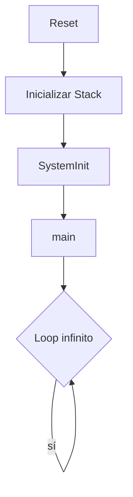
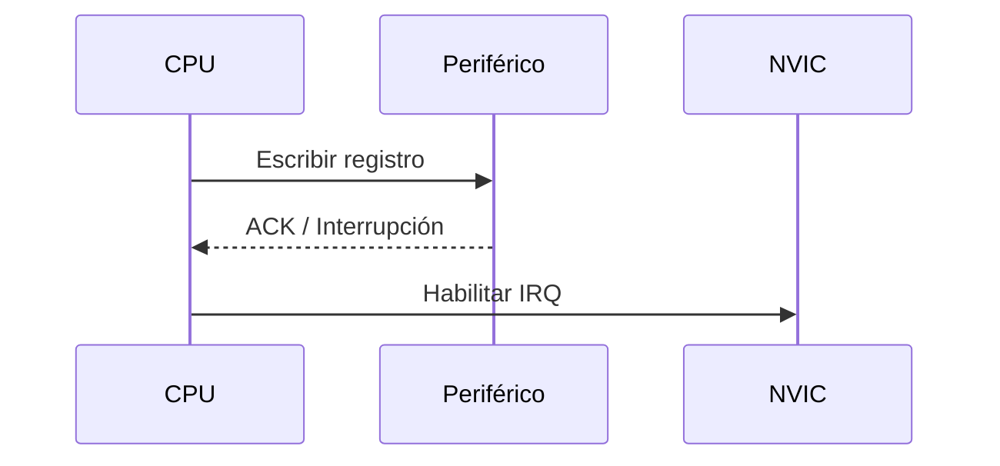

# Guía Demo Completa de Markdown

> Archivo de referencia rápida — copiá y pegá lo que necesites.

---

## 1. Encabezados

# H1 — Título principal
## H2 — Sección
### H3 — Subsección
#### H4 — Sub-subsección
##### H5 — Nivel 5
###### H6 — Nivel 6

---

## 2. Énfasis de texto

Texto normal sin formato.

*Cursiva con asteriscos* o _cursiva con guiones bajos_

**Negrita con asteriscos** o __negrita con guiones bajos__

***Negrita y cursiva*** o ___negrita y cursiva___

~~Tachado con doble tilde~~

---

## 3. Listas

### Lista desordenada

- Elemento A
- Elemento B
  - Sub-elemento B1
  - Sub-elemento B2
    - Sub-sub-elemento B2a
- Elemento C

También funciona con `*` o `+`:

* Item con asterisco
+ Item con más

### Lista ordenada

1. Primer paso
2. Segundo paso
   1. Sub-paso 2.1
   2. Sub-paso 2.2
3. Tercer paso

### Lista de tareas (Task list)

- [x] Tarea completada
- [x] Otra tarea hecha
- [ ] Tarea pendiente
- [ ] Pendiente también

---

## 4. Links e imágenes

### Links

[Texto del link](https://www.example.com)

[Link con título tooltip](https://www.example.com "Título que aparece al hover")

Link directo: <https://www.example.com>

Email directo: <usuario@example.com>

Link a sección del mismo documento: [Ir a Tablas](#8-tablas)

Link con referencia (definida al final):
[Google][google-ref]
[GitHub][github-ref]

### Imágenes


Imagen con referencia:
![Logo][logo-ref]

---

## 5. Código

### Código inline

Usá `int main()` para el punto de entrada en C.

El registro `LR` (Link Register) en Cortex-M3 guarda la dirección de retorno.

### Bloque de código (sin sintaxis)

```
void funcion() {
    return;
}
```

### Bloque con resaltado de sintaxis

```c
#include <stdint.h>

// Registro de control del SysTick
#define SYST_CSR  (*((volatile uint32_t *) 0xE000E010))

int main(void) {
    SYST_CSR = 0x7;  // Habilitar SysTick con clock del sistema
    while (1);
    return 0;
}
```

```python
def fibonacci(n):
    a, b = 0, 1
    for _ in range(n):
        print(a, end=" ")
        a, b = b, a + b
```

```bash
$ gcc -o programa main.c -mcpu=cortex-m3
$ objdump -d programa
```

```json
{
  "microcontrolador": "LPC1769",
  "arquitectura": "Cortex-M3",
  "frecuencia_max": "120 MHz"
}
```

---

## 6. Citas (Blockquotes)

> Esto es una cita simple.

> Cita con **formato** y `código` inline.

> Cita de primer nivel.
>
> > Cita anidada (segundo nivel).
> >
> > > Cita de tercer nivel.

> **Nota:** Las citas se usan mucho para notas, advertencias o fragmentos de datasheets.

---

## 7. Separadores horizontales

Tres opciones equivalentes:

---

***

___

---

## 8. Tablas

| Registro   | Dirección    | Descripción               |
|------------|--------------|---------------------------|
| SYST_CSR   | 0xE000E010   | Control y estado SysTick  |
| SYST_RVR   | 0xE000E014   | Valor de recarga          |
| SYST_CVR   | 0xE000E018   | Valor actual              |
| SYST_CALIB | 0xE000E01C   | Calibración               |

### Alineación de columnas

| Izquierda  | Centro       | Derecha    |
|:-----------|:------------:|-----------:|
| texto      | texto        | texto      |
| 0x0000     | 0x0001       | 0x0002     |
| 128        | 256          | 512        |

---

## 9. HTML inline

Markdown acepta HTML directamente:

<details>
<summary>Hacer clic para expandir</summary>

Contenido oculto que se despliega. Muy útil para notas largas o respuestas.

```c
// Código dentro de un bloque desplegable
uint32_t leer_registro(void) {
    return *((volatile uint32_t *) 0xE000E010);
}
```

</details>

<br>

Salto de línea con `<br>`.

Texto <mark>resaltado en amarillo</mark> con `<mark>`.

Texto <sub>subíndice</sub> y texto <sup>superíndice</sup>.

---

## 10. Notas al pie (Footnotes)

El LPC1769 tiene un núcleo Cortex-M3[^1] que opera hasta 120 MHz[^2].

[^1]: ARM Cortex-M3 es una arquitectura de 32 bits con pipeline de 3 etapas.
[^2]: Frecuencia máxima según el datasheet rev. 9.

---

## 11. Definiciones (abreviaciones / glosario)

Algunos renderizadores soportan listas de definiciones:

Término 1
: Definición del término 1.

Término 2
: Definición del término 2, puede
  ocupar varias líneas.
: Segunda definición alternativa.

---

## 12. Escape de caracteres especiales

Caracteres que hay que escapar con `\`:

\*no es cursiva\*  
\`no es código\`  
\# no es encabezado  
\[no es link\]  
\\ barra invertida literal  
\> no es cita  

---

## 13. Saltos de línea y párrafos

Dos espacios al final de una línea  
generan un salto de línea (line break).

Una línea en blanco separa párrafos.

Esto es el primer párrafo con texto normal que continúa aquí.

Esto es el segundo párrafo, separado por una línea en blanco del anterior.

---

## 14. Texto sin formato (preformateado)

Indentando con 4 espacios también se genera un bloque de código:

    void loop(void) {
        while(1) {
            __WFI();  // Wait For Interrupt
        }
    }

---

## 15. Emojis (en plataformas compatibles)

:white_check_mark: Completado  
:warning: Advertencia  
:bulb: Idea  
:book: Documentación  
:gear: Configuración  
:fire: Importante  

---

## 16. Diagramas Mermaid (GitHub, Obsidian, etc.)





---

## 17. Variables matemáticas con LaTeX (en plataformas compatibles)

Inline: $f = \frac{1}{2\pi\sqrt{LC}}$

Bloque:

$$
V_{out} = V_{in} \cdot \frac{R_2}{R_1 + R_2}
$$

$$
\tau = R \cdot C
$$

---

## Referencias (para links por referencia)

[google-ref]: https://www.google.com "Google"
[github-ref]: https://www.github.com "GitHub"
[logo-ref]: https://via.placeholder.com/100x40 "Logo de ejemplo"
